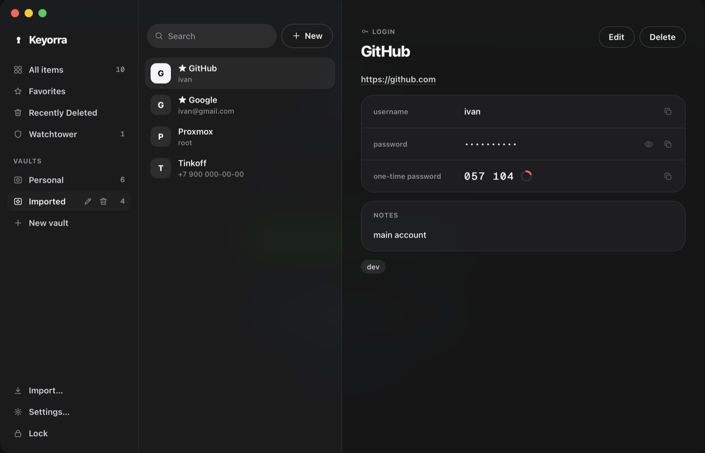
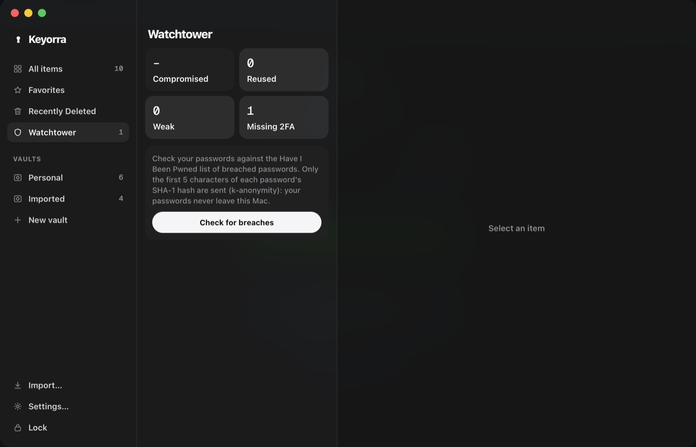

<p align="center">
  <picture>
    <source media="(prefers-color-scheme: dark)" srcset="docs/assets/banner-dark.svg">
    
  </picture>
</p>

<p align="center">
  <a href="https://github.com/skensell201/keyorra/actions/workflows/ci.yml"></a>
  <a href="LICENSE"></a>
  <a href="https://github.com/skensell201/keyorra/releases/latest"></a>
  
</p>

Keyorra is a free password manager for macOS. Your vault is an encrypted SQLite file on your
Mac; there is no account, no cloud and no telemetry. It imports your 1Password export, fills
logins, cards and addresses in Chrome, Firefox and Safari, generates one-time codes, and
unlocks with Touch ID. The core is written in Rust, the app is built with Tauri.

Website: [keyorra.com](https://keyorra.com)

<p align="center">
  
  
</p>

## Features

- **Vaults and items**: logins, credit cards, identities and secure notes, with favorites,
  tags, password history and Recently Deleted.
- **One-time codes (TOTP)** stored next to the login and filled with it.
- **Import from 1Password** (`.1pux`) and from CSV.
- **Password generator**: random passwords or passphrases.
- **Watchtower**: weak, reused and missing-2FA passwords. An opt-in breach check asks
  [Have I Been Pwned](https://haveibeenpwned.com/Passwords) using k-anonymity: only the first
  5 characters of each password's SHA-1 hash leave your Mac.
- **Touch ID** unlock (the master password is still required every 14 days and after your
  fingerprints change).
- **Menu bar** item and **⌘⇧Space** quick search from anywhere.
- **Sync** between your Macs through **iCloud Drive** or any folder you choose (Dropbox, Google
  Drive, a network drive), end-to-end encrypted: the folder only ever holds ciphertext, padded
  and signed per device. A 128-bit **Secret Key** (in your printed Emergency Kit) is mixed into
  the keys, so a copy of the folder is useless without it. Your **main Mac** approves every new
  device by a code you type, and can remove devices. The Sync screen shows exactly what the
  folder holds and can verify everything.
- **Browser extensions** for Chrome and other Chromium browsers (Brave, Edge, Opera, Yandex),
  Firefox and Safari: autofill logins and one-time codes, save new logins and update changed
  passwords, offer a strong password on sign-up forms, and fill cards and addresses.

## Install

Download the latest build from [Releases](https://github.com/skensell201/keyorra/releases/latest):

| File | What it is |
|---|---|
| `Keyorra.dmg` (or `Keyorra.zip`) | The app. Drag Keyorra to Applications. Apple Silicon. |
| `Keyorra-for-Safari.zip` | Carries the extension into Safari. Unzip and move to Applications. |
| `keyorra-chromium-<version>.zip` | Extension for Chrome and other Chromium browsers. |
| `keyorra-firefox-<version>.zip` | Extension for Firefox. |

**First launch.** The builds are signed with a personal Apple Development certificate and are
**not notarized**, so macOS blocks the first launch. Right-click the app → **Open** → **Open**,
or try to open it once and then go to System Settings → Privacy & Security → **Open Anyway**.
Do the same for "Keyorra for Safari". Touch ID records are tied to this signature: a build
signed by someone else (for example your own build from source) cannot read them, and you
turn Touch ID on again with your master password.

## Browser extension setup

1. In Keyorra: Settings → Browsers → **Connect browsers**. This installs the native-messaging
   host for every browser it finds; run it again if you move the app.
2. Install the extension:
   - **Chrome / Chromium browsers** (until the store listing is live): unzip
     `keyorra-chromium-<version>.zip` into a folder you keep, open `chrome://extensions`, turn on
     Developer mode → **Load unpacked** → pick that folder.
   - **Firefox**: open `about:debugging` → This Firefox → **Load Temporary Add-on…** → pick
     `manifest.json` from the unzipped `keyorra-firefox-<version>.zip`. Temporary add-ons are
     removed when Firefox quits.
   - **Safari**: open "Keyorra for Safari" → **Open Safari Extensions Settings** → turn on
     Keyorra and allow it on websites.
3. Click the Keyorra toolbar icon → **Connect**, check that the code matches the one Keyorra
   shows, and confirm in the app.
4. Focus a login field → click the Keyorra icon in the field → pick a login. In Chromium you
   can bind "Fill the best login" in `chrome://extensions/shortcuts`.

Cards and addresses are offered only on https pages, this Mac or the local network. Payment
fields inside separate iframes (e.g. Stripe Elements) are filled one field at a time.

## Security model

- Your master password goes through **Argon2id** (64 MiB, 3 passes) to a key that unwraps a
  random **account key**; the account key unwraps one random key per **vault**. Changing the
  master password re-wraps only the account key.
- Every item is encrypted with **XChaCha20-Poly1305** and a fresh nonce; the vault and item IDs
  are bound in as associated data, so ciphertexts cannot be swapped between items.
- Everything lives in a local SQLite file in `~/Library/Application Support/app.keyorra.mac`.
  Nothing leaves your Mac except the opt-in Have I Been Pwned hash prefix.
- Browsers talk to the app through a native-messaging bridge. Each browser is paired once with
  a key exchange; both sides show a confirmation code that you compare before the app accepts it.
- Touch ID keeps a wrapped account key in the macOS keychain, accessible only to the signed app.
- Only audited crates are used for cryptography (`argon2`, `chacha20poly1305`, `p256`); there
  are no hand-written primitives.

- **Sync**: each record is sealed twice (account layer hides even its kind; vault layer binds it
  to its header), packed into padded, hash-chained segments signed with a per-device Ed25519
  key kept sealed to this Mac's Secure Enclave. Only the main Mac can approve or remove devices;
  rollbacks, forks and withheld changes raise alarms. Removing a device stops its changes from
  counting; until key rotation lands it can still read new changes while it reaches the folder,
  so also cut its access to the folder (sign it out of iCloud). The protocol is public:
  [docs/sync-protocol.md](docs/sync-protocol.md), with test vectors and the
  [sync design](docs/superpowers/specs/2026-10-05-keyorra-sync-design.md).

Details: [design spec](docs/superpowers/specs/2026-10-02-lockbox-mvp-design.md) (written under
the project's earlier working name). To report a vulnerability, see [SECURITY.md](SECURITY.md).

## Build from source

Requirements: macOS 13+, Xcode, Rust (stable), Node 22 and pnpm.

```bash
cargo test                          # core + session
cd app && pnpm install && pnpm test # UI
cd app && pnpm tauri dev            # run the app (vault in ~/Library/Application Support/app.keyorra.mac)
app/scripts/sign.sh                 # signed build (Personal Team), installs /Applications/Keyorra.app
```

Layout:

- `crates/keyorra-core`: encryption, vault store, item model, TOTP, generator, 1Password
  import, Watchtower. No UI.
- `crates/keyorra-session`: desktop-app logic (unlock throttling, auto-lock, clipboard clearing,
  import flow, browser bridge) over the core, without any UI framework.
- `app/`: macOS app, Tauri 2 shell (`app/src-tauri`) + React UI (`app/src`).
- `extension/`: browser extension for Chromium browsers, Firefox and Safari (TypeScript).
- `safari/`: Xcode project for "Keyorra for Safari.app", which carries the extension into Safari.

### Touch ID

Touch ID needs a signed build (`app/scripts/sign.sh`): the keychain item that holds the wrapped
account key only opens for the app's stable team signature. Dev builds (`pnpm tauri dev`) are
signed ad hoc and keep their own item. Turn it on in Settings → Touch ID.

### Browser extension

```bash
cd extension && pnpm install && pnpm test && pnpm build   # dist/chromium, dist/firefox, dist/safari
```

Load `extension/dist/chromium` unpacked (extension id `kaaofpbpmnghapcafbbhjflonijdijbj`) or
`extension/dist/firefox/manifest.json` as a temporary add-on, then pair as described above.

### Safari

Safari loads web extensions only from inside a Mac app, so the extension ships in
"Keyorra for Safari.app" (`safari/`). Its app extension relays each message to the Keyorra
app's socket and starts Keyorra if it isn't running; no host manifest is involved.

```bash
safari/build.sh                           # builds extension/dist/safari and the app, installs it to /Applications
KEYORRA_TEAM=ABCDE12345 safari/build.sh  # same, signed with another Apple Developer team
```

The build is signed with the team in `safari/Signing.xcconfig` (a free Apple ID's Personal Team
works; sign in once in Xcode → Settings → Accounts). Without any team, sign ad hoc and enable
Develop → **Allow Unsigned Extensions** in Safari after every restart. Reinstalling "Keyorra for
Safari" gives the extension new storage, so pair again; restarting Safari keeps the pairing.

The app extension is sandboxed. Its one exception
(`safari/Keyorra for Safari Extension/Extension.entitlements`) allows connecting to the app's
socket and nothing else; `safari/check/sandbox-check.sh` checks it against the running app.

## Roadmap

- A self-hosted Keyorra sync server for Linux (single binary or Docker), then WebDAV and S3
- Key rotation, so a removed device can no longer read new changes
- iPhone app
- Sharing vaults with family
- Passkeys
- Windows

## Contributing

Bug reports and ideas are welcome in [Issues](https://github.com/skensell201/keyorra/issues).
See [CONTRIBUTING.md](CONTRIBUTING.md).

## License

Keyorra is free software under the [GNU General Public License v3.0 or later](LICENSE).
